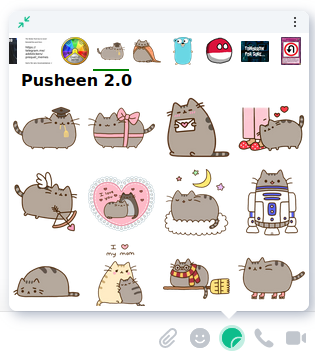
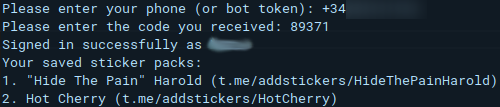

# Maunium sticker picker multiuser
A fast and simple Matrix sticker picker widget. Tested on Element Web, Android & iOS.

This repository is a fork of [`maunium/stickerpicker`](https://github.com/maunium/stickerpicker)

## Preview
| **Element Web** | **Element Android** | **Element iOS (dark theme)** |
|-|-|-|
|  | ||


## Comparison with other sticker pickers

* Scalar is the default integration manager in Element, which can't be self-hosted and only supports predefined sticker packs.
* [Dimension](https://github.com/turt2live/matrix-dimension) is an alternate integration manager. It can be self-hosted, but it's more difficult than Maunium sticker picker.
* Maunium sticker picker is just a sticker picker rather than a full integration manager. It's much simpler than integration managers, but currently has to be set up manually per-user.

| Feature                         | Scalar | Dimension | Maunium sticker picker |
|---------------------------------|--------|-----------|------------------------|
| Free software                   | ❌     | ✔️         | ✔️                      |
| Custom sticker packs            | ❌     | ✔️         | ✔️                      |
| Telegram import                 | ❌     | ✔️         | ✔️                      |
| Works on Element mobiles        | ✔️      | ❌        | ✔️                      |
| Easy multi-user setup           | ✔️      | ✔️         | ✔️                      |
| Frequently used stickers at top | ❌     | ❌        | ✔️                      |


## Requirements
To use this utility you need to have installed
- Python 3.10 or higher
- [Poetry](https://github.com/python-poetry/poetry)

Define as secrets in the repository:
- `SCM_USER`: GitHub user name.
- `SCM_EMAIL`: GitHub user email.

These are used in GitHub workflows.

You need to be able to use GitHub runners, in case you have access to free ones use self-hosted and change the labels in workflows. You also need to enable pages in the repository.

Translated with DeepL.com (free version)

## Instructions

### **First steps**
Go to the `pages` branch:
```sh
git checkout pages
```
Execute in the root of the project:
```sh
poetry install
```

### **Install the widget to a user**
Run the following command:
```sh
poetry run user install STICKER_SERVER HOMESERVER USERNAME ACCESS_TOKEN
```
Arguments:
* `STICKER_SERVER`: URL where the sticker website is hosted (no `https://`)
* `HOMESERVER`: Domain of the server (without `https://`)
* `USERNAME`: User name of the server to which the widget is to be installed (without `@` and `:domain`)
* `ACCESS_TOKEN`: Access Token of the user

Options:
* `-s/--selected`: To use the packs selected by the user (Default: all)
* `--port`: Matrix server location (Default: 8448)

You can also execute this [workflow](https://github.com/mariocarpente/stickerpicker/actions/workflows/user-install.yml)

### **Uninstall the widget to a user**
Execute the following command:
```sh
poetry run user uninstall USERNAME ACCESS_TOKEN HOMESERVER
```
Arguments:
* `USERNAME`: User name of the server to which the widget is to be installed (without `@` and `:domain`)
* `ACCESS_TOKEN`: Access Token of the user
* `HOMESERVER`: Domain of the server (without `https://`)

Options:
* `--port`: Matrix server hostname (Default: 8448)

You can also execute this [workflow](https://github.com/mariocarpente/stickerpicker/actions/workflows/user-uninstall.yml)

### **Create a pack**
Execute the following command:
```sh
poetry run pack create NAME TITLE
```
Arguments:
* `NAME`: Name of the pack
* `TITLE`: Title of the pack shown in the stickerpicker

Options:
* `--id`: Pack ID (Defaul: name)

You can also execute this [workflow](https://github.com/mariocarpente/stickerpicker/actions/workflows/pack-create.yml)

### **Add image to a pack**
Execute the following command:
```sh
poetry run pack add-image PACK_ID NAME
```
Arguments:
* `PACK_ID`: Pack ID
* `NAME`: Name to be given to the image. The number that corresponds to the image in the pack is calculated

Options (at least one required):
* `--image-url`: URL of the image to download
* `---image-path`: Path of the image to be added

You can also execute this [workflow](https://github.com/mariocarpente/stickerpicker/actions/workflows/pack-add-image.yml)

### **Uploading and updating a pack on the web**
Execute the following command:
```sh
poetry run pack upload PATH
```
Arguments:
* `PATH`: Path relative to the pack folder containing the `pack.json`.

Options:
* `--config`: Path to the `config.json` with the homeserver and the token (Default: `config.json`)
* `--homeserver`: URL of the Matrix server (Needs `--access-token`)
* `--access-token`: Access Token of the service user (Needs `--homeserver`)
* `--write-conf`: Write into config the passed homeserver and access-token
* `--title`: Overwrite the pack title
* `--id`: Overwrite pack ID

### **Import Telegram pack (requires user iteration)**
Execute the following command:
```sh
poetry run import PACKS
```
Arguments:
* `PACKS`: Telegram sticker pack URLs to import

Options:
* `--list`: List your saved sticker packs
* `--session`: Telethon session file name
* `--config`: Path to the `config.json` with the homeserver and the token (Default: `config.json`)
* `--homeserver`: URL of the Matrix server (Needs `--access-token`)
* `--access-token`: Access Token of the service user (Needs `--homeserver`)

Example of the data required for the import:



### **Add an imported pack**
Applies to all imported packs, both scalar and Telegram.
Run the following command:
```sh
poetry run pack add-imported PACKS
```
Arguments:
* `PACKS`: Id of the packs to add to the user separated by spaces.

You can also run this [workflow](https://github.com/mariocarpente/stickerpicker/actions/workflows/pack-add-imported.yml)

### **Add pack to a user**
Execute the following command:
```sh
poetry run user add-packs PACKS
```
Arguments:
* `PACKS`: Id of the packs to add to the user separated by spaces.

Options:
* `--username`: User name without `@` and `:domain` (required)

You can also run this [workflow](https://github.com/mariocarpente/stickerpicker/actions/workflows/user-add-pack.yml)

### **Delete pack a user**
Execute the following command:
```sh
poetry run user del-packs PACKS
```
Arguments:
* `PACKS`: IDs of the packs to be deleted to the user separated by spaces.

Options:
* `--username`: User name without `@` and `:domain` (required)

You can also run this [workflow](https://github.com/mariocarpente/stickerpicker/actions/workflows/user-del-packs.yml)
